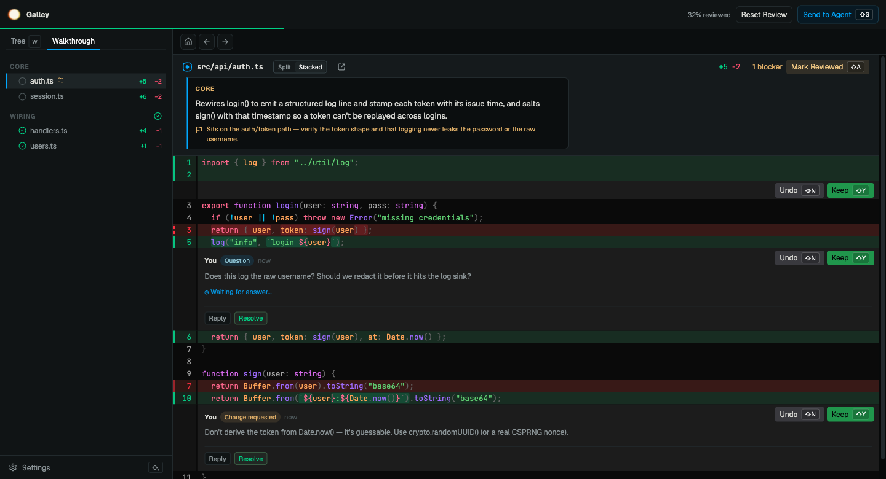

<div align="center">


# Galley

**An integrated review environment (IRE) for code you didn't write by hand.**

[](https://github.com/ymansurozer/galley/actions/workflows/ci.yml) [](https://www.npmjs.com/package/galley-diff) [](./LICENSE)



</div>

<br>

Code editors and IDEs were built for a coding-first world. Their diff view is fine for a quick glance, but not for working through a big change or going back and forth with the agent that wrote it.

Galley is my attempt at a real review surface: you review, hit **Send to Agent**, and your agent acts on your decisions and replies in place.

I'm not saying this is *the* review surface. I built it in a week and I'm still figuring out the shape. But this is what I think it should be.

> The name comes from the *galley proof*: in printing, the rough proof pulled for proofreading and corrections before a text goes to press. You mark it up, then it ships. Same idea, for code.

## Getting started

1. **Install the CLI** (needs **Node 20+** and **git**):

   ```bash
   npm install -g galley-diff        # global, for any repo
   # or: npm install -D galley-diff   # per-project
   ```

2. **Teach your agent to drive it.** Install the skill for on-demand use:

   ```bash
   npx skills add ymansurozer/galley
   ```

   Or paste the [snippet](./skills/galley/agents-snippet.md) into your agent's `AGENTS.md` / `CLAUDE.md` to always review via Galley.

3. **Start a review:**

   ```bash
   galley                       # review the working-tree diff
   galley --diff staged         # review the staged diff
   galley file path/to/plan.md  # review a single file or artifact (e.g. a generated plan)
   galley pr feature-branch     # review a branch's commits vs its merge-base
   ```

   Galley opens in your browser and stays open. You review and click **Send to Agent**; the agent attaches, acts on each send, and replies in the same tab. The full agent contract — modes, the event loop, all flags (`--repo`, `--path`, `--port`, `--no-open`, `--guide`, …), `ReviewResult`, and the guided-review schema — is printed by **`galley spec`**.

## Features

- **A beautiful and functional diff view** built on `@pierre/diffs`.
- **Per-line comment threads.** Comment on any line. Ask a question and your agent answers live in the thread; leave a change request and it rides to the handoff.
- **Per-change accept/reject.** Accept or reject individual changes, or sign off a whole file.
- **A tight handoff loop.** Hit **Send to Agent** and your agent gets a structured review. It makes the edits, re-diffs into the same tab, and replies in place.
- **Guided review.** Your agent can attach a guide: an overview, the files in a sensible order, a per-file orientation (the lens to read it with) and category, and the risky ones flagged.
- **Four review modes.** The working tree, the staged diff, a single file (tracked or not, like a plan, PRD, or issue), or a branch against its merge-base.
- **Keyboard-first.** Intuitive navigation: move by file, line, or change, and accept, reject, comment, or approve without touching the mouse.
- **Open in editor.** Configure a repo-scoped editor command and jump from the review desk to the current file and line.
- **Customize** diff layout, intra-line, hunk separators, wrapping, code-highlight theme, and fonts.

## Principles

Galley is opinionated about exactly one thing: the review surface. It's a protocol and an interface, nothing more. How you review, and what you review with, stays yours.

- **No model runs here.** Galley doesn't call an LLM or orchestrate one. It renders the diff, validates the structured input it's given, and hands a result back.
- **Your agent, not ours.** The contract is plain JSON over stdout and a localhost server, with no assumption about who's on the other end: Claude Code, Cursor, Codex, a shell script. The guided review, the answers to your questions, the code changes themselves are all *your* agent's work. Galley just gives it somewhere to land.
- **Local and private.** The server binds to localhost on a random port. No telemetry. Your browser may fetch a web font; switch to system fonts and even that stops.
- **It won't touch your repo unless you ask.** Galley never edits your tracked files.

## Roadmap

Immediate to-dos, in rough priority order.

- [ ] **Anchor repair instead of stale-flagging**: when re-diffing on `reload`, try to re-anchor each guide entry to its nearest surviving section/line before declaring the guide stale, so a guide degrades gracefully across rounds (the agent edits between rounds, Galley's hot path) instead of invalidating wholesale on any drift. Keep clean "vanished → stale" semantics for anchors that genuinely no longer resolve.
- [ ] **Command palette**: add a discoverable Cmd/Ctrl+Shift+P palette for common review actions: file filter, find in diffs, next/previous file or change, accept/reject/request change, approve file, toggle layout/settings/sidebar, open in editor, reload, and Send to Agent. Keep keyboard shortcuts as the fast path, but make every major action searchable.
- [ ] **Commit/range/branch review modes**: expand beyond working/staged/file/PR branch reviews with `galley commit <ref>`, `galley range <base>..<head>` / `<base>...<head>`, and `galley branch <base>` so Galley can review historical or comparison diffs without requiring a dirty working tree.
- [ ] **Lazy diff/content loading + large/binary-file guards**: today every changed file's full contents are read and shipped up front; the only large-file handling is client-side render deferral. Move the guard to the data layer: classify each file by byte size and ship lightweight patch data first, hydrating full contents, highlighting, and rendered markdown on demand when a file is opened. Per-file `loadState` (`ready | deferred | too-large | binary | error`) with two byte tiers — an *eager* limit (~1 MiB, loaded up front) and a *manual* limit (~2 MiB, deferred until opened); over that is `too-large` (skipped with a summary + explicit load-anyway action), plus an image byte cap. Add **binary detection** (NUL-byte scan) so binaries are skipped rather than read as UTF-8 and handed to @pierre.

## License

[MIT](./LICENSE) © Yusuf Mansur Özer
